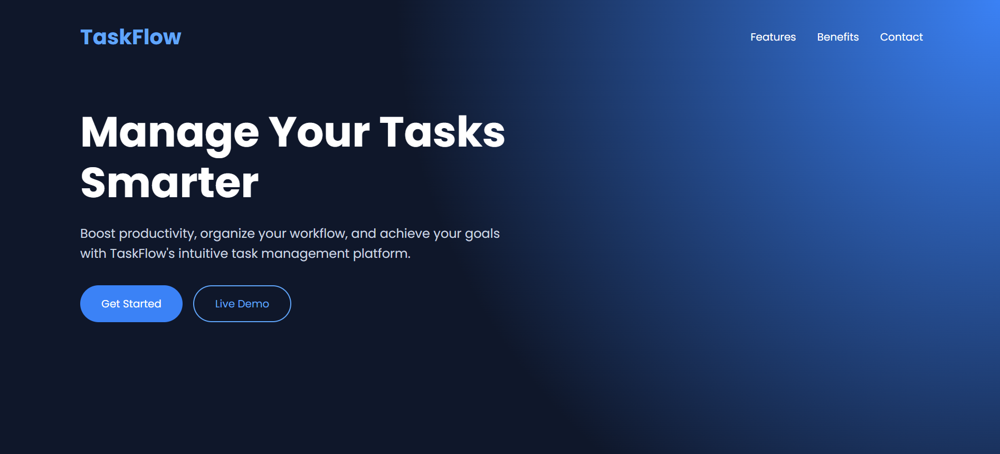
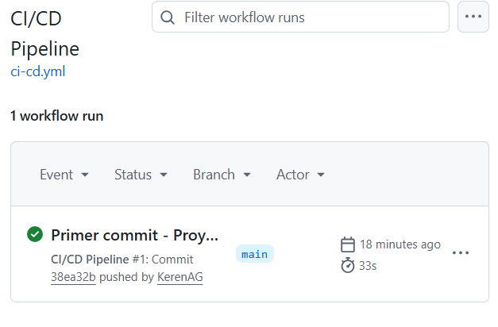
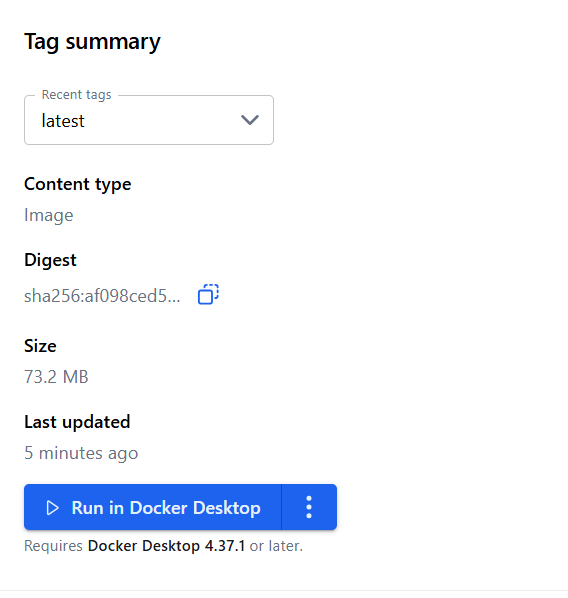

# TaskFlow DevOps CI/CD Project

Aplicación web desarrollada como práctica final de DevOps, integrando CI/CD con GitHub Actions, pruebas unitarias y despliegue con Docker.

## Descripción

TaskFlow es una aplicación web tipo "Hello World mejorado" con diseño moderno, creada para demostrar un flujo completo de DevOps:

- Desarrollo de aplicación web con Node.js y Express
- Pruebas unitarias automatizadas
- Contenerización con Docker
- Integración y despliegue continuo (CI/CD)
- Publicación en Docker Hub

## Tecnologías utilizadas

- Node.js
- Express
- Jest
- SuperTest
- Docker
- GitHub Actions
- GitHub
- Docker Hub

## Vista de la aplicación

## CI/CD con GitHub Actions

El pipeline ejecuta automáticamente:

- Instalación de dependencias
- Ejecución de pruebas unitarias
- Construcción de imagen Docker
- Subida a Docker Hub

## Docker Hub

La imagen del proyecto es publicada automáticamente en Docker Hub.

## Cómo ejecutar el proyecto localmente

npm install  
npm start  

Abrir en navegador:
http://localhost:3000

## Ejecutar pruebas

npm test

## Ejecutar con Docker

docker build -t taskflow-devops .  
docker run -p 3000:3000 taskflow-devops

## CI/CD Workflow

Cada push a la rama main activa automáticamente:

1. Instalación de dependencias  
2. Ejecución de pruebas con Jest  
3. Build de imagen Docker  
4. Push a Docker Hub  

## Deploy

La aplicación puede ser desplegada en:

- Render
- Railway
- Fly.io

## Autor

Keren Almonte Guilamo

Proyecto desarrollado como práctica final de Electiva 2 DevOps.